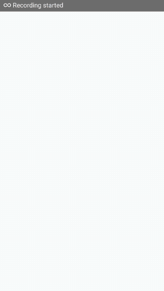

# HelloRN

react native 入门demo，适配android ios， 网页 图片 音乐 地图。

## Screen Shot




## API

非官方公共api， 均来源于Github开源项目，感谢原作者！
- 知乎日报

  ```
  热门列表  http://news-at.zhihu.com/api/4/news/latest
  ```

- 网易云歌单

  ```
  热歌榜 http://music.163.com/api/playlist/detail?id=${id}&updateTime=-1
  ```

- 煎蛋网

  ```
  妹子图 http://i.jandan.net/?oxwlxojflwblxbsapi=jandan.get_ooxx_comments&page=${page}
  ```

## TODOS

- [ ] 文章内容左右滑动翻页
- [ ] 文章 右上角 在浏览器中打开    
- [ ] 歌单滑动切换、随机播放
- [ ] 妹图Image高度自适应
- [ ] 数据缓存
- [ ] redux管理数据流


## Notes

1. 国内android无法运行Google Maps
2. video组件在android下无法获取歌曲错误信息（如404），导致界面卡顿，原因不明
3. simulator iPhone 6 地图界面出现错误，’permission denied‘，原因不明，其他机型simulator正常。
